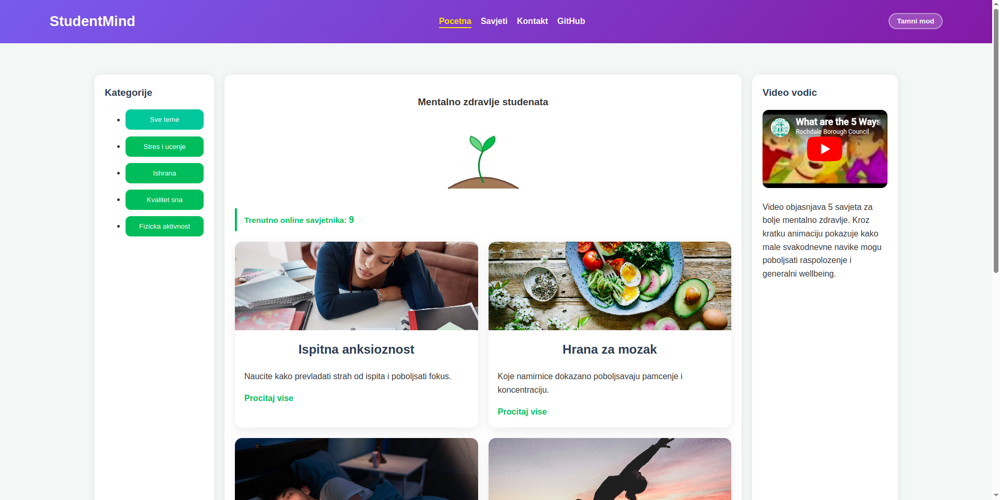

# StudentMind — Mentalno zdravlje studenata

**Tema:** Zdravlje i wellbeing studenata  
**Predmet:** TPTP 2026 — Grupa 41  
**Repozitorij:** [github.com/kenanikinic-a11y/Grupa41-TPTP-2026](https://github.com/kenanikinic-a11y/Grupa41-TPTP-2026)

## Kratki opis projekta

StudentMind je statična web stranica koja pruža savjete o mentalnom zdravlju i wellbeing-u studenata. Stranica pokriva teme kao što su upravljanje stresom, ishrana, kvalitet sna i fizička aktivnost.

Stranica se sastoji od tri glavne sekcije:

- **Početna (`index.html`)** — grid kartica s filtiranjem po kategorijama (stres, ishrana, san, fizička aktivnost), interaktivnim brojačem online savjetnika i embedded YouTube videom
- **Savjeti (`sadrzaj.html`)** — detaljan sadržaj i savjeti, galerija, SVG animacija
- **Kontakt (`kontakt.html`)** — forma za kontakt s validacijom svih polja

**Tehničke karakteristike:**

- Čisti HTML5/CSS3/JS bez frameworka
- Tamni/svjetli mod s toggle dugmetom i podrškom za `prefers-color-scheme`
- Responzivni dizajn (breakpointi na 1100 px, 900 px i 760 px)
- Progressive Web App (PWA) — manifest i service worker za offline podršku
- Lokalno čuvanje preferencija korisnika (`localStorage`) za temu i kategoriju filtriranja

## Članovi grupe i podjela zadataka

| Ime i prezime | GitHub username                                          | Zadaci                                                                                           |
| ------------- | -------------------------------------------------------- | ------------------------------------------------------------------------------------------------ |
| Kenan Ikinic  | [@kenanikinic-a11y](https://github.com/kenanikinic-a11y) | HTML struktura svih stranica, PWA (manifest, service worker), navigacija                         |
| Kerim Fazlic  | [@kerimfazlic](https://github.com/kerimfazlic)           | CSS dizajn (`tptpstil.css`), tamni/svjetli mod, SVG animacija, responzivnost                     |
| Kenan Lacic   | [@kenanlacic-oss](https://github.com/kenanlacic-oss)     | JavaScript (`tptpskripte.js`), filtriranje kategorija, validacija forme, logika toggle-a za temu |

## Screenshot naslovne stranice

## Upotreba AI alata

Određeni dijelovi našeg koda su generisani uz pomoć AI alata. U kodu su komentarima označeni ti dijelovi, npr. animacije, PWA implementacija i smooth scroll.
